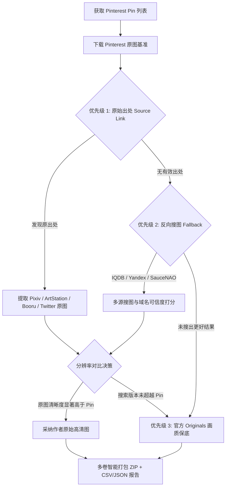

<div align="center">

# 📌 Pinterest Original Finder

**Automatically discover true high-res author originals, compare resolutions, and package into ZIP.**  
**自动寻找 Pinterest 图板背后真正作者原图、对比分辨率并打包导出的神器。**

[](https://www.python.org/)
[](LICENSE)
[](https://github.com/mikf/gallery-dl)
[](https://core.telegram.org/bots)
[](Dockerfile)

[English](#-english-documentation) | [中文说明](#-中文文档)

</div>

---

## 🇨🇳 中文文档

当你把喜爱的作品收藏到 Pinterest 图板时，Pinterest 往往会对图片进行二次有损压缩（常见为 736p 或 1080p），丢失了原画细致的纹理与色彩。

**Pinterest Original Finder** 专为解决这一痛点而生：它不仅能完整下载 Pinterest 图板，更能沿着 Pin 背后错综复杂的互联网线索，自动顺藤摸瓜找到画师在 **Pixiv、Twitter/X、ArtStation、Danbooru** 等平台的**无损原始大图**！

### ✨ 核心亮点与 3 级画质策略



1. **优先级 1：Pin 原始出处（Outbound / Source 链接）**
   - 自动解析并清洗追踪参数（`utm_*` 等）。
   - 内置 **Pixiv**、**ArtStation**、**Danbooru / Gelbooru** 专属大图提取器。
   - 针对通用网站，深度扫描 OpenGraph、Twitter Card 大图以及 HTML `srcset`（自动挑选最大尺寸如 `7680w`）。
2. **优先级 2：反向搜图与动漫引擎（Reverse Search Fallback）**
   - 来源缺失或分辨率不足时，自动触发 **IQDB (二次元动画插画专属引擎)**、**Yandex Images** 与 **SauceNAO** 反向搜图。
   - **域名可信度打分引擎**：将搜索结果按照可信度排序（Pixiv / Twitter / ArtStation / Behance / Cara > Boorus > 转载壁纸站）。
   - 严格进行分辨率对比，仅当搜索结果分辨率显著高于 Pinterest 压缩版本时采纳。
3. **优先级 3：Pinterest Originals 官方终极保底**
   - 若前两层均未发现超越 Pinterest 的版本，则直接以 Pinterest 官方的 `originals` 画质保底。
   - 并在元数据报告中明确标注「未找到更高清来源（使用 Pinterest 原图）」。
4. **大图板直连高速下载 (Cloudflare Tunnel 集成)**
   - 对于成百上千张图片超大图板（生成数百 MB 甚至几 GB 的 ZIP），无需受制于 Telegram 50MB 文件上传限制。
   - 内置轻量 HTTP 文件服务与 Cloudflare 隧道，直接向用户提供一条安全、防盗链、高速的移动端网页直下链接。
5. **智能磁盘管理与自动清理 (Storage Quotas)**
   - 打包完成后自动清理解压后的临时原图，大幅节省服务器磁盘空间。
   - 支持 ZIP 归档保留时长（TTL）与全局存储配额限制（LRU 自动轮替淘汰旧文件）。
6. **双重交互形态**
   - **Telegram 机器人**：手机聊天框发送图板链接，机器人异步处理并实时上报进度，完成后自动把 ZIP 包和报告直接回传至手机！支持任务取消指令。
   - **CLI 命令行**：终端附带彩色进度条与漂亮的 Markdown 统计表格。

---

### 🚀 快速上手 (Quick Start)

#### 1. 环境准备 (Python 3.10+)

```bash
git clone https://github.com/krantjohn/pinterest-original-finder.git
cd pinterest-original-finder

python3 -m venv venv
source venv/bin/activate  # Linux/macOS
# .\venv\Scripts\activate # Windows

pip install -r requirements.txt
```

#### 2. 命令行方式 (CLI)

```bash
# 解析图板（支持完整 URL、单张 Pin、手机端 pin.it 短链接）
python main.py "https://www.pinterest.com/username/boardname/" --limit 20

# 自定义导出目录
python main.py "https://pin.it/xxxxxx" -o ./my_downloads
```

终端执行完毕后输出详细统计面板与表格：
```text
                        Pin Processing Summary                         
┏━━━━━━━━━━━━━━━━━━┳━━━━━━━━━━━━━━━━━━━━━━━━━━━┳━━━━━━━━━━━━━━━━━━━━━━━┳━━━━━━━━━━━━━━━┳━━━━━━━━━━━━━━━┳━━━━━━━━━━┳━━━━━━━━━━━┓
┃ Pin ID           ┃ Title                     ┃ Status / Source       ┃ Pinterest Res ┃ Final Res     ┃ Higher?  ┃      Size ┃
┡━━━━━━━━━━━━━━━━━━╇━━━━━━━━━━━━━━━━━━━━━━━━━━━╇━━━━━━━━━━━━━━━━━━━━━━━╇━━━━━━━━━━━━━━━╇━━━━━━━━━━━━━━━╇━━━━━━━━━━╇━━━━━━━━━━━┩
│ 113842561208498… │ -                         │ reverse_search        │ 850x1327      │ 3576x4000     │ +1168.1% │ 5780.1 KB │
│ 113842561208498… │ Mika Misono               │ source_outbound       │ 1115x1859     │ 1200x2000     │   +15.8% │ 1693.0 KB │
└──────────────────┴───────────────────────────┴───────────────────────┴───────────────┴───────────────┴──────────┴───────────┘
```

#### 3. Telegram 机器人方式

1. 在 Telegram 联系官方 [@BotFather](https://t.me/BotFather) 输入 `/newbot` 获取 `API Token`。
2. 复制配置文件模板：
   ```bash
   cp .env.example .env
   ```
3. 在 `.env` 中填入你的 Token：
   ```env
   TELEGRAM_BOT_TOKEN=1234567890:ABCdefGHIjklMNOpqrsTUVwxyz
   # 可选：配置 SauceNAO API Key 增强插画反查配额
   # SAUCENAO_API_KEY=your_key_here
   ```
4. 启动机器人：
   ```bash
   python main.py --bot
   ```
5. 在手机 Telegram 中向机器人发送任何图板链接或单 Pin 链接即可！

#### 4. Docker 部署

```bash
docker compose up -d --build
```

---

### ⚙️ 进阶配置与私密图板

- **私密图板 (Secret Boards)**：
  通过浏览器扩展（如 *Cookie-Editor*）导出 Pinterest 登录 Cookies，命名为 `cookies.txt` 放入项目根目录下即可。支持 Netscape 格式或明文/加密 JSON 格式，脚本会自动适配。
- **配置项说明 (`config.py` / `.env`)**：
  | 环境变量 / 配置项 | 默认值 | 作用说明 |
  | :--- | :--- | :--- |
  | `TELEGRAM_BOT_TOKEN` | 无 | Telegram Bot 凭证 |
  | `SAUCENAO_API_KEY` | 无 | SauceNAO 反向搜图 API Key (可选) |
  | `MAX_PINS_PER_BOARD` | `3000` | 单图板最大抓取数量上限 |
  | `AUTO_CLEANUP_RAW_DOWNLOADS` | `True` | 打包 ZIP 后是否自动删除原始散落单图 |
  | `ZIP_RETENTION_HOURS` | `24` | 生成的 ZIP 文件保留时长（小时） |
  | `MAX_OUTPUT_STORAGE_MB` | `5000` | 输出目录最大磁盘配额（MB） |

---

## 📖 English Documentation

When you pin artworks to Pinterest boards, images are almost always downscaled and compressed. **Pinterest Original Finder** tracks down the true master original published by the artist across platforms like **Pixiv, Twitter/X, ArtStation, Behance, and Danbooru**.

### 🌟 Key Features

- **Cascading 3-Tier Quality Hierarchy**:
  1. **Tier 1 (Author Outbound Source)**: Scrapes original links, unwraps redirect trackers, extracts high-res images via dedicated Pixiv, ArtStation, and Booru extractors or HTML `srcset`.
  2. **Tier 2 (Reverse Search Fallback)**: Runs IQDB, Yandex Images, and SauceNAO searches with domain credibility ranking.
  3. **Tier 3 (Pinterest Originals)**: Falls back to Pinterest uncompressed originals if no superior source exists.
- **Smart ZIP Packaging**: Includes `report.csv` and `report.json`. Automatically splits archives for Telegram limits or generates single master ZIPs.
- **Direct Web Download**: Integrates Cloudflare Tunnels for direct high-speed browser downloads on huge collections.
- **Dual Interactive Modes**: Both rich interactive CLI and async Telegram Bot with real-time progress callbacks.
- **Auto Storage Quota**: Automatic disk cleanup of temporary raw files and LRU archive expiration.

---

## 📄 免责声明与开源协议 (License & Disclaimer)

- 本项目采用 [MIT 许可证](LICENSE)。
- 请仔细阅读 [DISCLAIMER.md](DISCLAIMER.md)。本项目仅供个人学习、技术交流与个人图像备份使用，使用者应遵守相关平台的条款与版权法。
